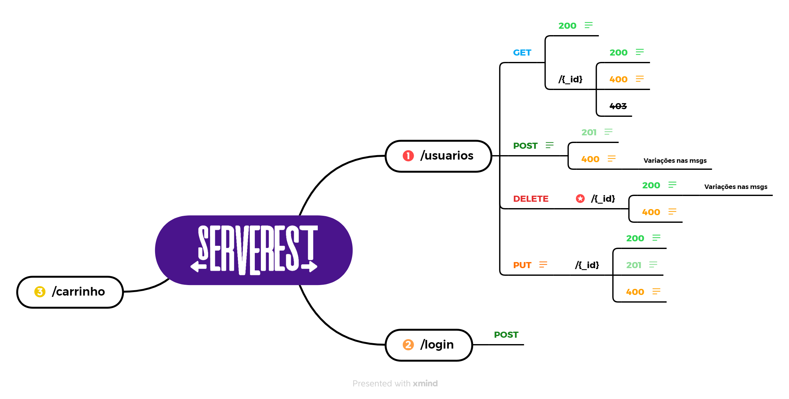

# LogicalForest_Nosvaldo_Souza_Compass
---
## Sprint 5 - Tech

 **Automação de Testes de API com Cypress**

---
**Tecnologias utilizadas nesta Sprint:**


| Framework | O que é...| Instalação | Download / Documentação | 
|--- |--- |--- |---|
|  | Node.js é um software de código aberto, multiplataforma, baseado no interpretador V8 do Google e que permite a execução de códigos JavaScript fora de um navegador web | GUI - Interface Gráfica | [Node](https://nodejs.org/dist/v16.17.0/node-v16.17.0-x64.msi) |
|  | O Visual Studio Code é um editor de código-fonte desenvolvido pela Microsoft para Windows, Linux e macOS. Ele inclui suporte para depuração, controle de versionamento Git incorporado, realce de sintaxe, complementação inteligente de código, snippets e refatoração de código. | GUI - Interface Gráfica | [Visual Studio Code](https://code.visualstudio.com/sha/download?build=stable&os=win32-x64-user) |
|  | O GitHub Desktop é um aplicativo que permite que você interaja com o GitHub usando uma GUI em vez da linha de comando ou de um navegador web. | GUI - Interface Gráfica | [Git Hub Desktop](https://central.github.com/deployments/desktop/desktop/latest/win32) |
|| JavaScript é uma linguagem de programação interpretada estruturada, de script em alto nível com tipagem dinâmica fraca e multiparadigma. Juntamente com HTML e CSS, o JavaScript é uma das três principais tecnologias da World Wide Web. | Plugin Incluso no VSCode |[Javascript](https://developer.mozilla.org/pt-BR/docs/Web/JavaScript/Guide/Grammar_and_types) |
| | Cypress é um framework de testes, de código aberto e de fácil configuração. Totalmente baseado em uma nova arquitetura, isenta de outros frameworks de testes, o Cypress apresenta um painel próprio que exibe exatamente o que está acontecendo durante a execução dos testes. | Linha de Comando | [Cypress](http://www.cypress.io) |
|<img src="data:image/png;base64,iVBORw0KGgoAAAANSUhEUgAAAWsAAACLCAMAAACQq0h8AAAAzFBMVEX///8oKCh5AOIAAAAhISEZGRkWFhYkJCQfHx9bW1ufn5+RkZFzAOELCws+Pj5eXl6KiorIyMjUvfW3ju5OTk5ra2sRERGEKeRxcXFUVFS6urqXl5eysrLdzPerq6t6enqPROaBgYGbYejx6fzl5eWBHuPY2Nj29vbBwcHi4uLw8PC5le/Q0NBpAN+cnJwwMDDj1vg5OTn28f3p3vrayPa+nPCINuWibOrNs/Ore+zIq/Kxhe2lcerv5/vEpfGXV+iUUefWwfWod+uVUufpqnXKAAAT4ElEQVR4nO2da3ubOBOGccCGxDhOWttJnNaOm4MTNzSHpk3P3e7+///0WgihZyQhsC3w7vVmPvRqjBDoRkijmdHgeS/yb5L547bv4P9Dvvy4TJgc/f2KHrg+7pvk5GR6wQ7v7Z4o0p+eji+U2q/7/Nj0Vr3uzQE/srvH/poMs+rVWmfz5dGr6bEqsw/X6rXG01xo2T312leTWX+wv7873VNv6/7r56N15PPzUxno+fckjne4xHH8Gg7d+lFglra/bP/E1w9E7ZHfOl0gUFFJ5PfplQ/8dnaWP2a1FV2s8+B5F347UqXd6flhF3Ev6ygQeu1FN/JH7SAMwyBaVnJ8Bce+JILGqhIn3+2ov8S06jiWfbvbbhVJb0mnH5mPhR1/Os8rGffyA50BXnnm5wfaXc/bDQov5l95k1HBsbY/lE/2xFIHPP/lQybHIn9wkx9clzSTxDoQv070E/KnY2Hd2bPSafvXopJDybrlT+SVb3wofup5g7Cwtt61t9cpPBr5+QCxX1yHn/fdq7ZeV+B3s6PnOpDqEttGkU+mmhMxjqzPetk2cfNXwDTch84FlXcmG7BeXmu4AuuxbyzU262Z9b254uTt5qxb/gGv5MLHH+W18X0fvdmIdauzW5n12C8o0B7Uy/pzwTmXpawZHTvrFpvwljInrOU4jlx6h3bWhyWsW6NZKWs+It8UoV4+sPTteNyI9f2q3Xp5zp8y1qyblLAWYAlrqTWotVlYLw+XsG75t2Ws+VXviktknWMD1DtJcbf+XjTnxs+l/dorZ92eprXA3Ch6l/YIbuysvVLW4Z2ddcB1vr0idSaVHivyfn1FJMNmlCMolsSoV8YlrFOFoox1pmc9AACpDVDWCxvraFjOupUqPsWsswv3io6n0jndrGPHFpVPDiHxu+X7/lXCTuY21oF/7FVh3UmVMZwE2cDMZa5OmcWs2cBTyjrqW1gHmVr4xtqt+dvqne+s17Pj+GMxamDNBxpgfa6xjvxcBnzWI6zb6ZEewR+csGJDWPL0crV7UZV1lA6jhHXIr0WXUr7KegQ3nD3iQUnvyLrC6+X6eTXe7AT7olFlfWlhHR0shIjTkXX7wJvP54vDAXkV0glpBkyY+sIFVcF0sB2YOfWO0yEeWYf7i4uLi5vDIRkR2OyIrEfjCyFC+ZkrSkgYKOzbs6zk2/fP76icEbaflaPP78tsIauwbne10wlrcZgsk9OpsKssWrjgEicYKKyXj2TORF6Lss5+nOGDZY9R1SMVOaTDtX/XP+mRvhE+FLL6gx09fl9CVpc6WCPDVu9WwdT5IE6+hXazyY+ubcbqtYysyfzKJrYS1nTQb6fT5QF9OQpZvSKsXxeWK5K4Btak/Wl7cUKSxbCPRezVXYe1MoqVsSbvgZ/ZUvvkRVSNtLk4ZJ1qK/WwRqr5gOiN1SewDuu+wnpgZ42zdChsjldE/7/STspkU9ZSv+bqSj2scVSJjkUxNJKmuqET1kb10jMWN9+w5s8QsilrObdyo0k9rNEEEeQme4SXaidNsz413nBtrN/l58ff2N/1sEZNmmvcTE6h7lTrds76Wq1jq6ylPYQr4vWw9owGbDRfpy1sgDWO102z/iXP/83+rp91KxTFptDuVA1vmnXD4zXo56mxqSbWaMfMFVhsd2qjaoA1Pl+pETXD+qNiAKmJ9cDEGk9Of1T9NFScsEZrQTQ13nBtrNHQx7znNbEeIlax7t5XH0ADrHGOkBpRQ6wl3HRyrIn1VB0umMDAwu38DbBG3SfI4ycaYv1DVnDk1cYaq8kXwbBa40u4BlhPiD3EeMP1sf5FV+k1sUZO+SIYle7UqdoAa+IqyGeOhljfgyLyqjbW2MS8MbhwT6epBlhfE9OHGM0aYo2T44/aWGMTBQFcTPJzG2BN7L2mN6xW1uBtiHXWp25Yo6laaM7oltHdkjWxJmFB+fGmWIODPr6vizUan0aZY4b8lpJtgDXxgeVui6ZYvwXW373n2ML6QDu5KuuF1odZuLFKpQHWHs6NkQgCbIq1h5FP3s88RITHhxDWM+3cqqzn2thMHQi8gU2wJn70wHTDdbL+LStI7r3z5zjdYBDz4ElHrPEn8XqMMVI49ZQ3wRpXVbki0hjrb2QQWcrjfJ5vnXHFGpbjwgyBeiBvdBOsiXNXFGiMNYbAxupBV6zB9iFGSVzC8VVFE6xJ0IJ4xRpjjWHBWvSwK9aARDhmTrfCmih93AzTJOtPMIioYZauWB/LYVJwQpMb9x80wZrGTmYDdnOsf8IgooYPu2INYMPM5AOzVBY90AhrEgySXaU51iQw+As95Ir1B/SZ81LQ1TNLciOs8U7EhRtkDYPIzhk95Io1xoJk5jWglKkmjbC+NUSUNcgaNZHkJznkijVRprljBvximT7QCGsaqdobazdcL2tif6J1uGKNvSmbkGCzQbZsb4Q1jTxO4+MLYvFVccP6i7Z3Q4gr1mjLzBwzatRTU6zpVon0JUPTTH3xfJngcuYPHnDF+kJvjWZ6csL6pJQ1HbB5OPh1r5ftWh8Vx187Yv0M1fzGA65Y4yiZjYj6L30HrPulrMnt5cuZNzwZw7A7N57DxBFrMKzS3euuWBOymukv24c3NG71EOKM9ZDssvEL50JVHLHGXWbxL/jdGWvEmM79aNLOZkvXrPXYqVTGZCtY1DcWMogr1qhif4bfnbEG4xPHiG6ZTAtsiLWyP6l4I4Eirlg/FqjYzlhDSa7hEc2El2mItbIr09Ass7hijR4D3OLkjDWsyPneWLIziZdpijUdRDAbgVWcscaKjuTPzliD8YmvEiGMQZBrijXVRGBnWnVEG7HGxDuJ3OnrjDVUxK0f0LlEEGNjrKd0v2+vGiF3rGErevwp/9WRH514YbhjBn/Itis1xvqKduzRpKAcFXesMZOIHESQdTiYZbJU+qfpBFedNXbjNIUN2DbFQySstfavzjoYdg9y6aKy/UB3vrcrEXLHGlVsHhvCBFm3QkzBNmIm/+qswc/HPQNglhADJrLuVGSt7iUlroCgDeJPZV1KTrRqHdsh69cwiHwTPxLWVHpvClhfmEyU8NryZTHsoBVNXYc17g5hCg5hTQVzxtFBJAzUi5nEIeuPMIjkNhELazWjXs762pQGBx9A+sqCEtjLxtU1WJN1CXtmFtZoLZ3RdlXq2Juz/shE2R8tDauWBCnsjTWyJksFEeM8V5cuAEX0/TVYk9h1BrMi6wvasSuN2Juyvo8TlmQkuXyig8jbNVhn2wX3sFvLFBEqazB+CpPx6qxvNK94RdZqxswqHXtT1nlfTp5I2LtYOtpYn1LW4Ul3KQcD0nypJ6LDkS3UwEAiLBLVWbfuJntLmerm0aqsFbUvbKmXc89ajtGXuJyJ/ypnzWiQ4SJMp3uqTUkvx4PCFjeBzXXWrY7MH9Q71W+lw4T2zVSdsc2NxOOiJCPqFenidbBOyD4lMWBbWLNRtiy3ltxqRcYMNl/qpifFsIyUtHxPxlLzEtbE7nGrdOx9r0ycsobKREIuSwMZodJciLIrAcj0V4zILmOdrjTLWI/SubmYdUBSFGsdu9jPWAtrMKyKmJziBqYvdgnrHqzqYccsGzhBL8m7VCHr1GBSwjrgzqxi1r7ipVE6tsxr0ghr3Fj6tYQ1T2RtZ91GlwesE5lvCtwy+f7ZjVj3FnbWvsZS7dhlplW3rMH+9NnAOszXu6NswWtlTYdA0ISZXQkU3LxHbcJ6lC0KCevcqLC8YX2zz6FiWtWS7NfKGmpLdNbhfm7ImWQtK+nXQ7gShLYzDQZ0rlwvLB6vy1kHg7nGOjzJv2swwZz+QmiOylK1zy1riFjNHGHYwGiqnV4yXndOZFEwPjHl7Jb+mUoh6/RplIwh0d1cZV1oU81krCTrK/Gou2WNGjaPet+Mdasn31ylI4PRJF+zFbLuVdH5ovTBrsLaC0nHNrSPiGPWf8mURDxyYUPW4KQGvzlLxgf27BxJsX6t3oq5FKtnJdaKabU4DWIqjlmr6Z9WYh31mFADmlyjL+hkCM3M185FrPn3JCjrERO6SE3n4pVYK6bVgtgdIY5Zyz1h2W6OFVhH09vDw8Pr04i+mIZ2MbUCKs5XEZR1yCVoZyoEYf1wPV7K6R0NYbpYlfUB6RklKrZj1k+yujOtgSWshU11TpLUSwM9sD4hhvF8nKGs97kMZpkF3GhTJS8WY7saa8W0ah9EHLOG9E+XWgMrsqbb2mTouHwEzNAKPSpfRGzqK2AKDfFZltuT6Kd/iuPcmThmjat0rYFVWRv9jWSZFpCwAWNis6o+MFz8sclhRdbX1AKsL3hAHLPW/nbIGvJr+YTJKC+xBmvVj26Pe9CFaCKW5Neee9bq9wocsqY9WZ4puTlnbXC2jE/4NDDMjtHZ0TctL4W4Zi0r42HYDll3yQgt18fBrihxXD/rQz/g6k3UC1Ou1D9j1fr+Q6xRy1vATCk1rQZYg/884PaPFmpNhtAuKa5ZQ16cn2oDN2QNxif/BrYqyzDBBlhjJF8vHc7JViWrd6bGfu2aNUz5y9ULWEfydL0Ns+YPmboMbEZsdzn0U9c5GlVdjyFg2VvqsbKMpNow64i/UNpnU4pkU9aYz+Lo3Wdtn6ND1mB86h3CGkRqwdthjVc1XFbKpqy/4vkoWdSCQ9YLxLvwDSW2w5qkorTZVTdl/VTIemWbahlr7MpvwBAhHdjbYU2zt1gmx43j+QpQiwARh6xxiN6Dz4xIEzdhrXn/6mKN2wGt5qeNWX8xfyxTbC2YOGQNRU9hopRT/5ZYkwHbsgNv8zjV36ZRJBZ7HNFzsSlrmeCgfQC2QNmTtsSaxroWKyIO4q8/67DjS3HQJWuJJZqCC0zuDNoSa5IMwGKvchHr/k4dRpK/8mOE9VA7dSXWsp3R8ZscHNjWtsSa2MDlykoTynr179yl8ucSvgu5/C/kfHLJWprUgv6e/L+Ma9gSazI5WpQ+zEHGYqjXlKcfPOZ9+e8zyR/ikrXc+RUOpAsMat0Wa2xFYEkF8I2nP01ToP4qLlYuj/dPf57u1U/zumQt6wr3D/I2ww7VbbHGD6HYY4Mfz7lYvmC8vrhkjWFGss0wQG6LNUkjF2nnNCUuWcN8H0iHGCwQt8Xa/MEIp/IpSUonU5es0QXyIIFIB+y2WBPHv531405y9tNawnjWWaxl49PFJWt1n5tWYFus6QcjbC5HlhgrTr7ZShiEf3QtLjvNJWv1e9lZ2+TeiW2xviGsrWlyUmrJOyszVX4k1TRyl6w9M2vZtm2xXhDWNzYeGbade1shIh8v44qrH6esjaGR8M5ui/V8VdbLrl112fgrXwA1y5rG8Yu2yeP/DtbW/WCS3FkVHXv+l+JktIlT1sZo7X8Ba28N1oYc+Lq8jdGp2CjrY8MggmFdLlhPN2Vtj58kJpGvtpJL+U6MepBtyCxOWR8YEmSA6em/xnonPrKpzOdHirH66EyXZ5layy1r/BqEqdKmWdu/AfvJgOaM0tuxqNoFDi9FYljhOGU9MbGG5GiuWRt2LGKOlnyTHXEWiPH6OSlyexPYv7VLcNGcAkWwf9TDWslBqJzVCGuS50fkViAB75m+f16VlVHVPt+p8qBSOauH9SHdT8h5wHveAGtiZmr5zOG1OCavW6YX3VeGZVK1q6Oui/WVYeGIsf8NsFYz8/mtjk93RD2synoneaVepTDqpjLroL+4yESs9VZjbTI+kYRXjlm3P8xTWSzk2tRoJwARrosVWKvfLlE8k2uxbgUyVU2nuwZrk/EJlw6uWbfa8oYHWRR74X5VcT+Hq7PeUW/1seJgb2GNMkq3f6/G2tSp0PzgnDVI4PMOOzbMGSgib8wKrEGVEPKrOuwKrHkShRVZG3Q+NBfXyTqbCI33gKhFHoLqrOPYYBl5FVc9/58KrFPlaEXWD7rxCd0g9bIO+QfeJtaOnQcG3VftmQVGqEdDiJNJEumQt7AeTVZmfaIbn5pjLYYrwwOXRaRWVLFfFhtXX6tPKzZIAuOPhXVh3sli1vrEJD450gTrbJOX2RXHLwpa7ccsYoaKis/mNLinWnb891tdzqG8aamXCTMnrMh6phmfSHKxmlmLUL3DIthtGhtyr6NRFOcyZxhZqJfaVN2y7mqsyfoIWetxdc5Ye9e+cRgZDdRL6kLGheRLWfFvydZY68YnEj5HWGtbw92x9m5aujYS+lW+x4Hsjs7Ly/+UhtVy1sWzdkfJydwxsvaRtf7kCFIX/VofpuStwKbcrt+haU78/dJciExgj+L3KuU972tSlfXcb0dmaTOdb+JHQSaRXAEOffFj0CahLbrxiQzLyDrop9lpmYy5/nAlaw38/ElM8NdDNj5EgVk6JO/y/MOdP2qnZaNOzx9W/FJVDi7PpFwqf6r60b2b2dAsPIXKeNjPZAj94lT82J+SyBbd+ERCy5F1K+gIGfn9dJvH7e5ACDyhSf7jyTW/o4Emu+xWZmqQzcW4e7yssj/bq/xJMME6/qfiN2mYpFFPFXxgbuVGY00228+KxtoobPQ2LcJZJytGBL9np9GPNdYuC501dqlC1q1O1e9I1S1s7218+bG8IJV7toWgjvuxiMaaRL4Us64penR1+ZKQpV51+fa+lphti2hzI4lUtLAu/gpuw/LqdfXwsu3KnbqIIP3Vwrrip41eRMpANT5VZV31+2gvkotqfKK5eV9YuxR1BR0SE8QLa5fyQbFDUNe8ZX1dmgj8RVRRFzM+2ZG8Z3ECVV/avUgmXb83yqXn04iTedsfaZImH/b10JQXKZWLNMFvJloI/+1Yk2uWfLiSDe5F/v/kf8gRQusIRhppAAAAAElFTkSuQmCC" height="50"/> | O ServeRest é uma API REST gratuita que simula uma loja virtual com intuito de servir de material de estudos de testes de API. | Linha de Comando | [Serverest](http://www.serverest.dev)

Após instalados os softwares via interface gráfica, para dar seguimento com o Cypress, temos que verificar se o Node foi instalado corretamente. Para isso digite no prompt de comando:
```
node -v
```
 Se o NODE foi instalado com sucesso aparecerá algo como: v.16.17.0

Para instalação do Cypress, crie uma pasta para o seu projeto, abra o prompt de comando **dentro da pasta criada**, e digite o seguinte comando: 
```
npm install --save-dev cypress@9.7.0
```
Esse comando, também digitado no prompt de comando, dentro da pasta do seu projeto, irá instalar a API de TESTES Serverest localmente:
```
npx serverest@latest
```

---

<details open>
<summary>Mapa Mental - Serverest</summary>



</details>


---

## Referências
 * **_[QA Camp](https://www.youtube.com/c/QACamp), [Cypress](https://www.cypress.io), [Serverest](http://www.serverest.dev), [Wikipedia](http://www.wikipedia.com.br)_**

---
## Créditos

* Agradecimentos à SM Larissa pelas dúvidas sanadas e todo acompanhamento e dedicação no projeto e também aos colegas pelas colaborações em equipe.

